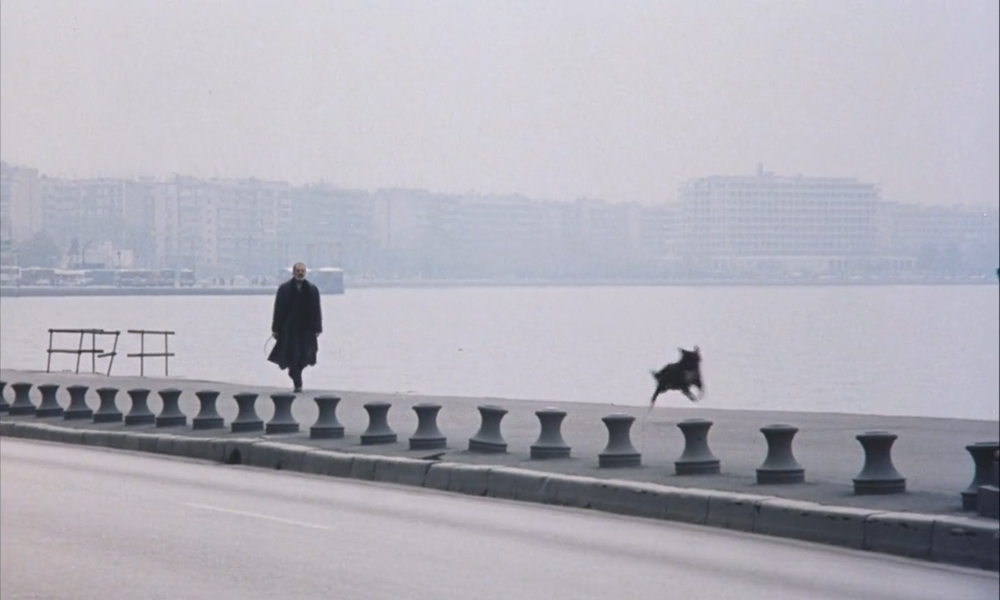
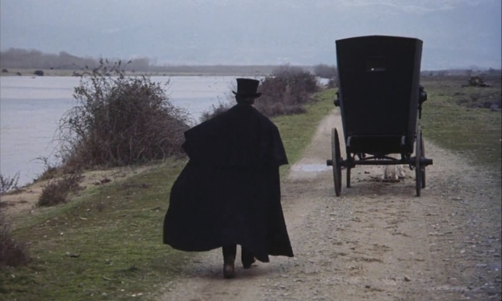
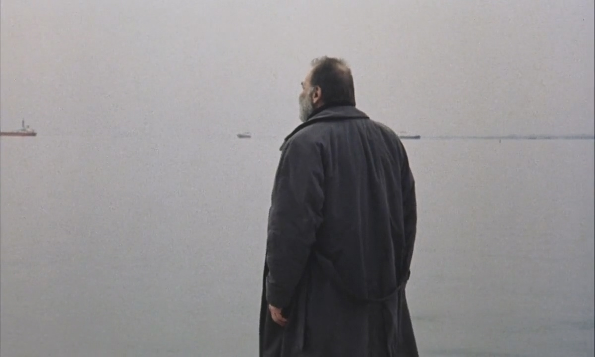
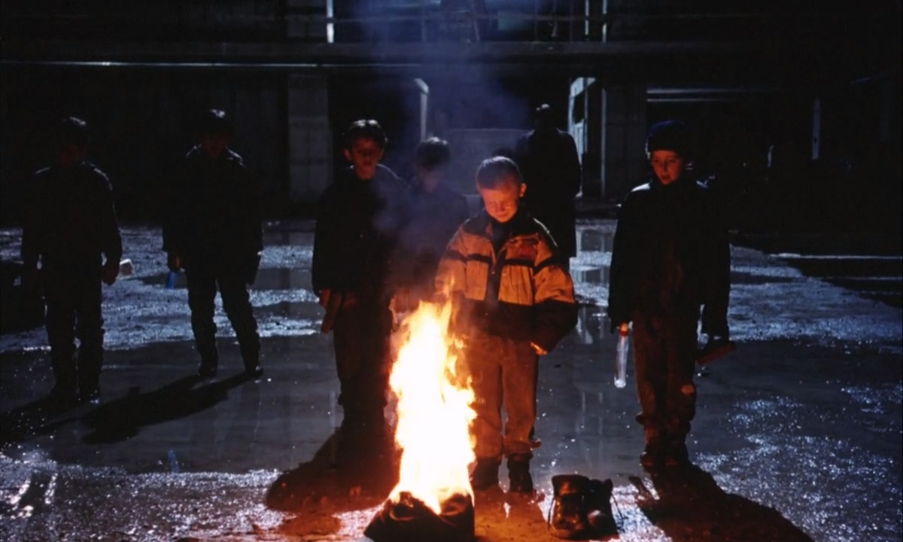
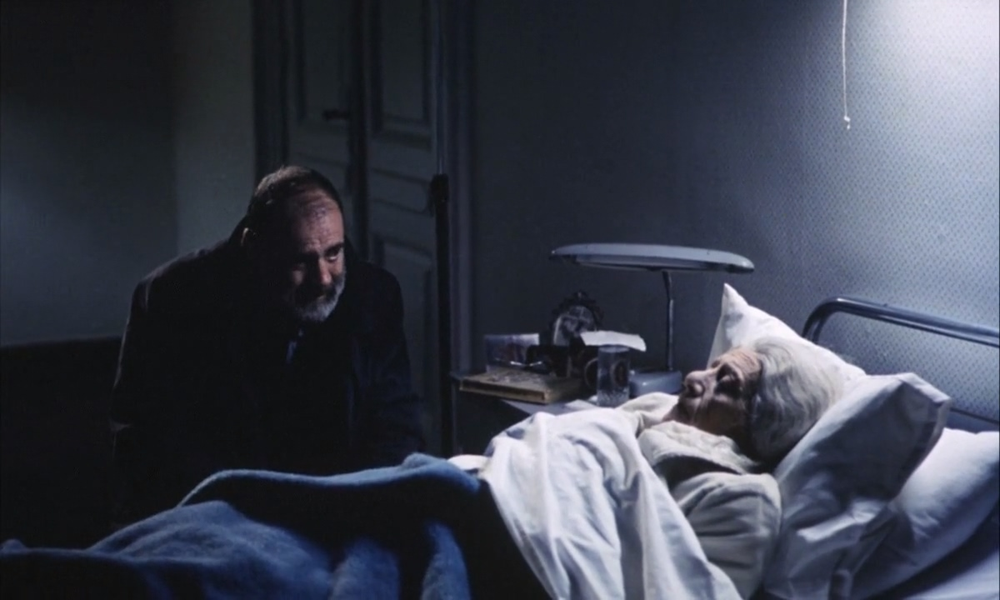

### 前言

[《永恒与一日》](https://movie.douban.com/subject/1293455/)

影片讲述的是平常的一天，而非不同寻常的一天。亚历山大也许踏上无尽头的旅途，也许像母亲一样留在医院——这不重要。

影片讲述的是一个陪伴终生的悲剧，而不是不知所云的“比永远多一天”。明亮的色彩中永远留着一抹黑色，就像白天到黑夜，这黑色越发浓厚、沉重。

我不知道影片中翻译的是否正确，一首诗的名字“*受困的自由者*”。它又一次使我回想起初识卢梭的感受，多么实在而有力的箴言“人生而自由，却无往不在枷锁中”。

这部电影讲述的是「**过去**」。

——本篇影评带有极强的个人色彩，较为客观的评价在小红书（目前还没写）。

——**注意**：对于现在的我来说，任何有关于「回忆」的艺术作品，只要能够**迫使**我回忆，我就会更偏向于解读记忆、以及称赞。这是片面的，我现在没办法走出去。

### 人物画像：不合时宜者

电影中主要人物仅仅只有一位——亚历山大。

初见，他就已衰老，直勾勾地盯着对面的音乐，似乎要使出全身气力抓住播放音乐的人。亚历山大十分清楚音乐给人带来的绝不仅仅是听觉上的。他知道，音乐是超越性的——能够无视距离而将两个人紧紧连结在一起，**没有隔阂**。在某种意义上，他在无限地渴求理解，也许是因为安娜注：他的妻子早已逝去。

<iframe width="560" height="315" src="https://www.youtube.com/embed/SMOZx2xabJE?si=GnthccFHSC8d-7P6" title="YouTube video player" frameborder="0" allow="accelerometer; autoplay; clipboard-write; encrypted-media; gyroscope; picture-in-picture; web-share" allowfullscreen></iframe>

一切都事与愿违。亚历山大是个奇怪的人：世界在高歌猛进，而他却停留在原处。作为一位成功的诗人，在这个时代很少见的那种，他并没有为时代写作，甚至没有为过去写作。亚历山大一直为十九世纪的一首诗工作，他希望续上这首《受困的自由者》。没有人理解他——甚至他自己都不知道自己在做什么。

十九世纪，希腊发生革命。一位希腊裔、生长于意大利的诗人，认为某种使命找上了他。他要回到故乡，歌颂革命、哀悼死者、参与斗争。然而，这位诗人并不会希腊语——他要重新学习血脉中的词汇。所以，他用金钱向村民买词汇，用以作诗。

那时，诗人能够起到何种作用，我们不得而知。但是，亚历山大此时为革命诗篇续诗，已然显得十分荒诞。现代社会中的诗早已死亡，荷尔德林处早已罕有人迹。他似乎活在过去，一个遥远得只能想象的过去——柏拉图与苏格拉底就生活在那里。

不幸的亚历山大，被女儿卖掉了房子，一只老狗也被拒之门外。他希望将狗交给自己唯一的朋友，却正好遇见她儿子的婚礼。一场极具特色、难以遗忘的婚礼中，亚历山大是一位闯入者。婚礼的音乐在他出现那一刻戛然而止，暗示着他的生命，对他人而言，是不合时宜的。

<iframe width="560" height="315" src="https://www.youtube.com/embed/Thp0DndhJH4?si=qR3u3bAawOPSuN4_" title="YouTube video player" frameborder="0" allow="accelerometer; autoplay; clipboard-write; encrypted-media; gyroscope; picture-in-picture; web-share" allowfullscreen></iframe>

回忆，如同梦魇，突然袭来。他内心深处最为深刻的画面，也将勾起观众的回忆——这时的故事变得不再重要，它显得可有可无。明亮的光影中总有一团黑色，那是遗憾。

不可追忆的世界，在何时出现？童年逝去之后。谁是漂泊的异乡人？我们有意识之后。远离母亲，童年的故乡，也随之远去；我们永远无法回家。横亘在我与母亲/故乡之间的是，知识与痛苦。

童年、故乡、回忆，如同那团燃着的火焰，将他拒之门外。新的伴侣、住所、身份、欲望，尽己所能将亚历山大推向现在。过去被燃烧殆尽，他无根无源，被抛在世界之中。

亚历山大想起了疗养院的母亲。他深知，在他思考的那一刻开始，过去的母亲就已死去。而母亲的呼唤，来自童年的呼唤、他童年的源头，像母亲躺在床上一般行将就木。亚历山大开始忏悔、倾诉自己的痛苦，可此时的母亲死之已久注：在他的内心中。但他还是不死心地瞥向母亲，渴求奇迹。

世界上没有奇迹，只有无尽头的遗憾。既定的命运——死亡——笼罩在每个人头顶，而过晚的死亡是一个人最大的不幸。无论是亚历山大，还是他的母亲，都像巴士上的旅客，眼睁睁地看着最动听的音乐离去。

<iframe width="560" height="315" src="https://www.youtube.com/embed/mbQHdkYzCqI?si=FxwJYjCagCd4MuCz&amp;start=170" title="YouTube video player" frameborder="0" allow="accelerometer; autoplay; clipboard-write; encrypted-media; gyroscope; picture-in-picture; web-share" allowfullscreen></iframe>

### 逝去者和停留者

逝去者：2、5、10、13、14

停留者：11、12

### 明天会持续多久？

9、15、18

一封信与不断浮现的回忆

### 零碎的词汇

《堤》、3

### 后记

我为何如此钟爱这部电影？

**TODO**: 9.15 之前写完，最近沉迷游戏（详见下一篇）。
