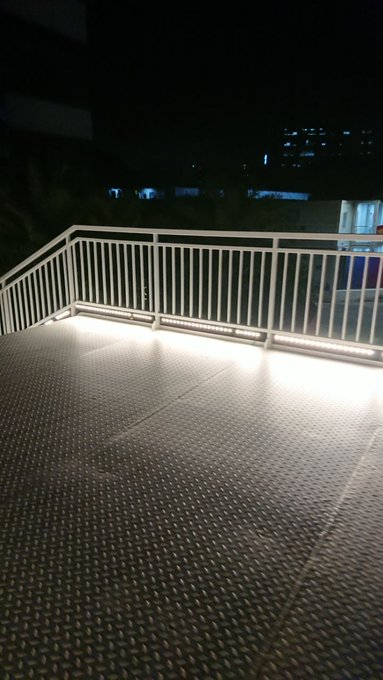

<iframe width="560" height="315" src="https://www.youtube.com/embed/2BYA0Lz-VsI?si=YvPkXM1N7jPE5agd" title="YouTube video player" frameborder="0" allow="accelerometer; autoplay; clipboard-write; encrypted-media; gyroscope; picture-in-picture; web-share" referrerpolicy="strict-origin-when-cross-origin" allowfullscreen></iframe>

### 前言

本篇介绍我的四年大学生活，着重介绍我的思想历程、生活经历，中间掺杂着对社会的失望与对自己生活方式的反思。本篇不太可能为读者提供有效的信息，它是给希望了解我本人的读者（含未来的自己）读的。

目前并不知道自己会写什么。此前列了一个框架，但是在其下无法写出自己想说的东西。现在我意识到博客可能是我大学四年最重要的财产，其他的一切（含四年的记忆、学到的技能、认识的人之类的）都抵不上我博客的一篇文章——能非常准确地将我移置到那时的情感之中，即便精神状态并不好。

简略地说，大学四年中，我初次探索自我却完全陷入「自我」与大量概念的泥潭中。个人的强烈自卑情绪与疫情的两年半完全阻断了我同世界的正常往来，那时，我渴求自杀。疫情之后，抬头张望，社会的废墟清晰地放在我面前。一切教人爬出废墟的攻略都明确地指向个人的原始积累，而我并没有原始积累。于是，我以自身仅有的信息来源与社会阅历，用「可能性」作为核心参考点，做出了最终的选择。

我对这所大学、对这样的生活没有任何留恋。我试图回忆起任何一件能让我铭记于心的事情，却无法找到。

### 疫情发展史

> 大学四年的前言：我的高中生活

18 岁之前，我从未仔细思考自己的生命，世界被蒙在一层纱之后。后续三年，一切都在疫情的阴霾之下，或者说政府的阴霾之下。

我生在湖北，家在武汉附近。2019 年 12 月左右，也就是疫情爆发之初，我正在读高三。2020 年 1 月放寒假，听到隔壁班的同学讲，他们的班主任说要保重身体、尽快回家，武汉那边有传染病——那时候新闻还未报道。后来， 封城数月。尽管在农村，政府管控仍能控制每个人的行动，每天一家只能有一个人出村购置生活用品。2 月到 5 月，我未踏出家门半步。这几个月理应是学生好好学习的日子，但我从未看过网课、也不将网络考试或作业放在心上。5 月初，高三学生被**豁免开学**，学生与老师均被封闭式管理，但依然被要求戴口罩（我常常因不戴口罩而被批评）。幸而高考延期一个月，否则对我而言，后果不堪设想。后续疫情管控逐渐松弛，我得以顺利上大学并参加军训，不至于到大三才军训。

如果仅仅从那时来看，**疫情对我是有利的**。因为困在家里的几个月，我得以在高三紧张的备考中获得一个放空的时期。这段时间中，我并没有做别的事情，只是看网络小说，看了很多。网络小说助长了我的幻想，直接导致了我转向书本以寻求答案，最终让我能在了解事实之后摔得更狠。再者，我的心情放松之后，返校备考的两个月中，我的成绩有了一段突破。

很简略地说，2020 年 5 月之后，疫情管控并不变态，只是基本上不错。该情况一直持续到 2022 年 Omicron 变异株。核酸检测的强度能够大致体现当时的疯狂程度，能体现方舱的强制收纳、医院的拒诊等多类不合理现象。从跨省测、抽风式检测（疫情之初），到每周两测（大概是 Omicron 之后不久），迅速地发展到一天一测与频繁封城（以 2022 年 4 月上海为甚）。一天一测持续了至少半年时间，直到 2022 年 12 月不作任何准备的放开（我实在无法想象，是什么样的官僚不准备任何医疗设施就放开的）。

非常巧合与不幸的是，**我的个人构建与疫情完全重合在一起**，一种深深的不安感贯穿我对未来的一切想象。

### 生活经历

> 我很难像回忆高中那样回忆大学四年，因为没有任何值得回忆的地方。

#### 前两年

前两年，我的生活局限在教学楼、食堂、宿舍之间。其中有大概一年的时间，出校都需要打报告，同时校内又必须戴口罩。现在回想，这段时间就想从未存在一般。可笑的是，若没有对核酸的印象，我便完全想不起这段时间是什么样的。请问读者能回忆起前天吃了什么吗？那段时间就是这样，一日接一日毫无意义地重复。吃饭是为了获取能量，那段时间则是为了满足上级变态的奴役欲望。后续，全国各地涌现了反抗事件（我只能说到这个程度）。放开的脚步显得尤为匆忙。旧电池早该报废了，新电池只是少用几年而已。这个玩具还能动，不是吗？

那两年我对社会事件的关注超出了个体的限度，因为无法做任何值得做的事情。这出自我个人与社会的共同影响。我很清楚只要我编造谎言就能够出校，但在我眼中，一道满是窟窿的墙总归是一道墙。但如果现在那堵墙摆在我面前，我会毫不犹豫地越过它，因为只要惯例与口耳相传。

*下两图*为疫情期间修建的桥梁，是汇集安全与美观的绝妙建筑。可惜没几天就被拆了，要不然新入学的学生还能多走几次弯路。

#### 后两年

2022 年是互联网神话完全破灭的一年，我此前的信息匮乏在这时给了我最响亮的耳光。17 岁时，我再三考虑，还是选择了计算机专业。入学时，院长大谈本专业的前景。分配的班主任在第一天开班会的时候说：“如果我是你们，我不会选择报计算机。因为在一段时间之后，一切热门的东西都是最惨的。”那时候，我就隐隐感觉自己的选择不对。尽管在现在的时间节点，计算机还能稍微高于传统工科。但那只是一堆垃圾中看起来干净一点的了。**用延迟满足来彰显自身所谓有远见的行为是彻头彻尾的愚蠢行径**。现在看来，这个社会本身就没希望了，为什么不选轻松或者自己喜欢的事情呢？

2023 年之前，我受着许多信息的轰炸，决定精进技术（在中国毫无价值的东西），再进大厂。事实证明，这是一个极度错误的决定，直接导致我缺少在其他事情之上的时间。生活不是线性的，要抛弃学生思维——我在一年前听到的播客终于听了进去，虽然有些迟了。互联网上声量最大的一批人往往是失败的，听取他们的建议无异于用自己的前途赌博。

再到后来，我彻底放弃愚蠢的大厂幻梦，开始思考其他出路。我开始思考并试图利用仅有的社会资源，开始调研直招军官、考公、留学、就业的可行性。最初，我选定了留学，并花费数天查询学校相关信息。由于 10043 与地缘政治因素，很多国家拒绝接收我这类的学生。范围一再缩小，但终究还是可行的。我选定 HCI 作为研究方向，认为本行业有前景。于是，我开始执行常见的步骤：雅思、科研实习、套磁。

在科研实习过程中，我越发感觉到自己是在逃避现实，并由衷感觉硕士学历的无价值（尤其是就业市场中）。2023 年 10 月，我匆忙地开始找工作，选定的行业为汽车制造业。为了发挥自己的比较优势（学历、专业、英语），我希望进入一家注重海外市场的、相对而言有前景的公司，从事自身专业相关、非写代码、可外派的岗位。目前，我对薪资或地域或工作氛围的要求并不高，很容易就找到了，毕竟也算个正经 C9 学生。

而科研实习本身，它除了对我的未来出路没有很大帮助之外，在其他方面，弥补了我对大学生活的想象。我可以非常明确地说明，疫情给人带来的创伤，只能通过大量的与人接触治愈。如果读者目前处于某种创伤之中，请快快进入友善的新环境中。

#### 学习经历

专业课程是谈都不愿意谈的垃圾，绝大多数人都是学国外的课程。

通识课程对重要的东西闭口不谈。

同学之间毫不相干，没有任何接触。

### 思想变迁

> 人生愁恨何能免，销魂独我情何限！故国梦重归，觉来双泪垂。 高楼谁与上？长记秋晴望。往事已成空，还如一梦中。

我的思想大都能通过博客反映出来。[第一版博客](https://xn--29s704loyd.com/old)以阅读为中心体现了我个人想法的剧烈转变，[第二版博客](https://xn--29s704loyd.com/about)则是我转向公共领域的尝试。本版博客则面向熟人与未来写作，并不想以[写作成功](https://xn--29s704loyd.com/diary/diary-2#%E6%88%90%E5%8A%9F%E8%80%85%E7%9A%84%E7%89%B9%E8%B4%A8superpowers)。

#### 博客前

> 2020.04 ~ 2021.04：正常防控的疫情

我常常以一场梦作为个人启蒙的开始，这是为自己的人生添加传奇色彩。事实上，我的个人启蒙并非源自于那场梦，而是 2020 年网课时代的大量信息冲击。此前，我拿到手机或电脑只是为了玩游戏、看小说，那时候逐步地关注社会新闻。可能出自人脑的保护措施，我做了一场梦。

那场梦中并没有什么值得考虑的事情，只是「我与一位女孩牵着牛走在土路上，时不时踩水凼的情景。当时我问她，『你在哪？』，她说***在江南***」。梦醒后，我不知道是江南行省，还是何处，只是有很强烈的感觉说必须要记住。后续高考返校，我有些牵强地把江南进一步解读为“浙江”，因而给自己立了一个浙江大学的目标。再到填报志愿时，我因为想选计算机，有意地忽略了浙江大学的医学院，即便它摆在我面前。我并不知道当时我选择那条路会怎么样，但是我已经为现在付出了四年的代价。巧合的是，我第一份工作就在江南行省。

言归正传，在写作博客之前，我怀揣着最朴素的理想主义情怀，即：道德出自人本身的良知，只有合乎道德，世界才能变得更好。当时的电车难题并没有困扰我，因为我并不认为这与道德有任何关系，此问题非天定。此类道德观出自我对卢梭的理解，有诸多不合理之处。

让我转变的是很小的一件事。在宿舍洗澡需要使用水卡机器，但是我所在的宿舍中有一个机器扣费非常慢，洗一次澡最多需要 1 毛。因为我不想放太多钱在水卡中，也不想频繁地充水卡，我选择使用它。此前，我并没有意识到我已然违背道德要求，但有一天我突然意识到。

后来我陷入大量的思考，这些想法并没有逻辑性。再到后来，我阅读了大量的书籍，试图从文字中找到世间的**一切答案**。

#### 第一版博客

> 2021.04 ~ 2023.04：变态的疫情防控+愚蠢的迅速放开

在大量阅读之后，我开始谋划创立博客，发出自己的声音。那时，博客并无确切构想，而仅是我表达自我的途径。我将自我比作是殉道者、先驱者、探索者，而不是一个站在原地等着别人投喂的人。现在想来，我确实做到了探索，但试图改变世界的重压完全压垮了我。我所谓的探索，也不过是把别人走过的路再走一遍而已——别人走到尽头，我本人却倒在了阅读他的路上。

第一版博客中，我从一个全然不知自我是何物的人，转变为一个极端悲观、企望自杀的人。此处我仅根据自己的回忆来作文章，而不是阅读此前的博客。

博客以「主观性是不可磨灭的」为题，试图通过热烈的自我宣言将「我」的观念推向世界。显而易见，这出自青年人的无知。当时，我清楚地知道「我根本不了解任何事物」，但依旧将我的观念当作是世间的一切。我认为这出自特定时期的脑神经错位，也可能是现在错位。

这种物理层面的神经错位贯穿了这段时间。

尽管在不断阅读，我从来只是将他人的观念整合在到自己的脑内，将无用的剔除，留下对我有利的思想用作论据。因此，我后续滥用抽象概念、创造黑话，也就不足为奇了。现在看来，这种强烈的自我观念既来自于我的本性，也来自于我强烈的自卑感。此观念后续催生出了希特勒式与哲人王式的极端生活理念，也最终导致我生命基础的坍塌。

在玩弄抽象概念的过程中，我对控制者（披着科学外衣的政府）进行了非常强硬的批评，并不时为其辩护。现在，我不再将科学与任何威权放在一起，而是将人与整体分隔起来。出于我个人的偏见，那时我蔑视、鄙视一切非个体的东西。与此同时，非理性与不可知论占据了我的心灵。其他不再言说，那并非什么值得关注的事情。

我深刻地意识到自己生活的不对劲，认为沟通交流是唯一解决方案。不知道是哪里出了问题，每到一个地方，我总会深切地迷恋某个女生。高中时期，我不清不楚地那位同学表白，幸而被拒绝。大学时期，我克制住了这种动物性的迷恋。不知这种克制行为对我那两年强烈的空虚感有何影响。最终，我的沟通交流策略一败涂地。

非常合乎情理的是，因为四处碰壁的失败与肉眼可见的社会衰败，我开始认真思考自杀。自杀的情绪来得很快，其阴云经久不息地徘徊。我到现在也无法说清那是什么感受。这种自杀的想法迫使我思考，我到底为何而活——这不是一个有答案的问题，但此类思考让我不断抛弃不重要的想法。

另外，提到自杀与精神状态，常常会使人联想到抑郁症。在此，我对抑郁症——本世纪的最大谎言——表示鄙视。一个不做区分的概念、似是而非的病症，到底是如何成为许多人自杀的理由的？我拒绝一切对抑郁症的辩护，自杀是个体选择，没有任何道理可言。一个人自杀的那一刻起，他就拒绝了一切解释。

#### 第二版博客

> 2023.05 ~ 2024.03：后疫情时期

本版博客试图摈弃第一版博客强烈的自我意识，转向公共创作领域——即，对他人有价值。很显然，我并没有做到，因为我对为他人写作没有任何激情。

这段时间并不值得细细说道的，因为我在弥补疫情时期的创伤。参与到生活中，我的自杀情绪迅速地消退（读者如果想要摆脱这种情绪，请找到自己的问题所在）。

### 社会氛围

> 如果青蛙耐不住寂寞，又算死水叫出了歌声。

#### 电池就是电池

因为众所周知的原因，我不想写这一段。一个人怎敢在监视器外头撰写日记1984呢？但我还是写了，以免自己日后像许多人那样几乎忘记是谁导致的痛苦。**人从生下来就不是痛苦的，如果你痛苦，就一定有人踩在你的头上**——一切都是别人的问题。

疫情的三年内，发生了什么，又隐含了什么。第一点是每个人都默认的，主人用电池给玩具充电，电池自己给自己充电。第二，主人可以监控电池的去向，如果主人不愿意电池行动，电池就只能待在窄小的电池盒耗电。第三，主人给每个电池贴标签，其中荷兰的红色电池不准充电，但是含红色电解池的不是电池。第四，电量多的电池看不起电量少的，但是主人不在乎。第五，主人认为，电量不稳定的电池早该报废了，其他电池少一点也无所谓。第六，主人认为，本土电池也可以是进口电池，因为它们是白色的哑巴。第七，电池哪来的传染病？

电池就是电池。

#### 怪异氛围

如今，社会陷入一种大跃进式的狂欢中。*我们相信，亩产万斤是完全可以达到的，这就是科学原理与伟大奋斗*。以前的亩产万斤到现在成了量子通信、量子计算机、清华的脑机接口、实用永远距今 50 年的人造太阳。所谓的科技进步就在一场场会议和 PPT 中完全展现了出来，拍几张似是而非的图片，就宣称已经实现突破。。需要我一个个驳斥这些进步吗？看别人是否公开会议纪要就行了。

肉眼可见的攻击出现在任何人能够触达的角落。任何公开信息都被攻击为虚假信息，任何私人信息都被驳斥为哗众取宠。我最初以为是「大众」的侵入使得社交平台变得“堕落”。但是，我很难将这么多的攻击都归结到所谓「大众」上去，因为我能很清楚地感觉到那些攻击是具有情感的。没有人会无缘无故地攻击人。

另一方面，两星期的宣传周期更加明显了。每过两周，真理部就会依法依规贯彻《商君书》的疲民之策，深刻落实思想大解放，坚定支持真理标准大讨论。此真理部深谙“阶斗”道理，挑起一派斗一派，自己当裁判。这是许多人支持完全回归线下生活的原因之一，网宣比“墙宣”要恶心得多。

现代年轻人热衷于回忆过去，至少我是这样。童年时期的动画、歌曲、玩具等等都会将我带回 10 年前，让我回忆起那个向上的时代。当时，我看到言论说，你们会怀念童年无忧无虑的时期。幼小的我想，你又怎么知道我的忧愁呢？现在我 21 岁，我真的忘了，也不知道你的忧愁。

#### 宏观经济

从 2018 年开始，因为众所周知的两件事情，许多人宣称“今年是过去十年最差的一年，也是未来十年最好的一年”，这样的陈词滥调重复了六年。值得高兴的是我们能够预测未来。

宏观经济很简单，出口差，内需差，招商差，倒闭多。土地财政彻底破产，鹅城 100 年内的税全都被收了。我记起来高中学校旁边的豪华厕所，突然理解它的存在合理性。如何去形容其豪华呢？一个公厕占地大约 50 平米，中间的洗手台与“客厅”占据了 2/3 的面积，而男女两方的厕所还没到 1/3，因为进入厕所中间还有一个空位。该厕所白天灯火通明，晚上射灯乱射，更像一个 KTV 而非公厕。这个厕所很可能是留给来访的领导的，更可能是竞标项目。

存量竞争中，恶性竞争严重——大多数企业都在倒闭前夕，强制加班、降薪、裁员一个接一个来。官方**城镇**青年失业率跌破 15%（不论其真实性，我预估在 50% 左右），但是如果真的参与到本周期的就业招聘中，只要有脑子就知道大多数找不到工作，绝大多数找不到理想工作。然而，许多找到工作的人的工资水准还停在 10 年前，而且工作强度更大。毫无例外，所有行业的薪资都在下调。在 2024 年，一个月三千的工资，别谈什么租房，能吃得饱住桥洞就算不错了。

于是，很多人选择不工作或延迟工作（考研+留学），而同时许多人选择考公，祈求有一口国家饭能吃——别人都要破产了，还求着它赏饭。还有一部分人回家啃老，我甚至认为这是故意的。00 后上一代掌握的钱都在银行中，某些人只能求着 00 后回家消费，刺激内需。但是，谁还相信所谓的新一代家电下乡？都留着过冬呢。政策的朝令夕改完全展现了某些人的猪脑子是也有转的一天，虽然完全是瞎折腾。

对于无法考入 985 的学生，高考是一场彻头彻尾的骗局。20 年前，这场考试能够改变一个人的命运。现在，这场考试除了给自己并不灿烂的人生抹灰外，还可能因其染上精神疾病。前朝的科举已经彻底死了，现在没有任何阶级跃升的机会。

这么多人生活得越发艰难，而社会在自顾自地稳中向好，是否要问苍天一个问题——你什么时候死的，黄天什么时候来？

### 后记

许多人并没有意识到疫情给他们生命留下的伤害，尤其是正处于自我构建阶段的青年人。许多人将疫情内化成了自己的内心中的一部分，称为“秩序”。然而，这种被金钱与暴力共同维持的秩序与个人有任何关系吗？
