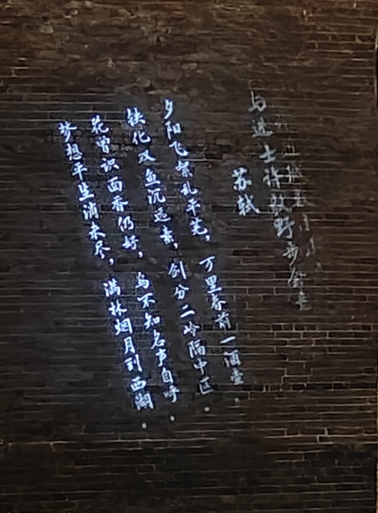
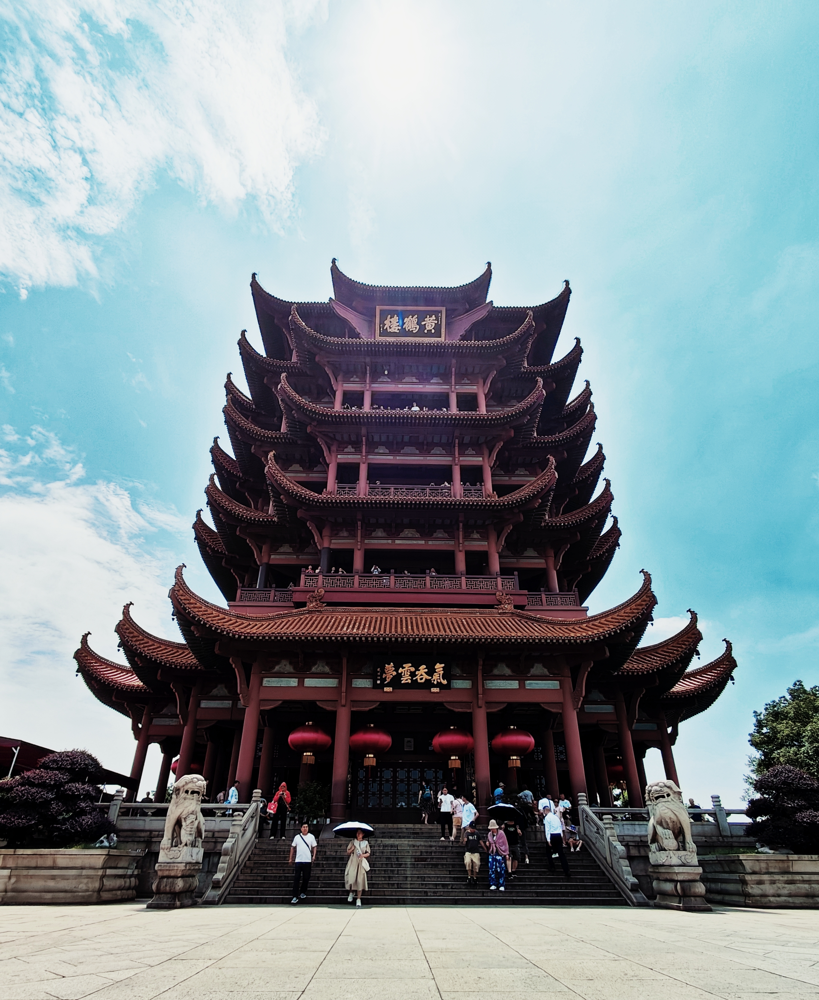
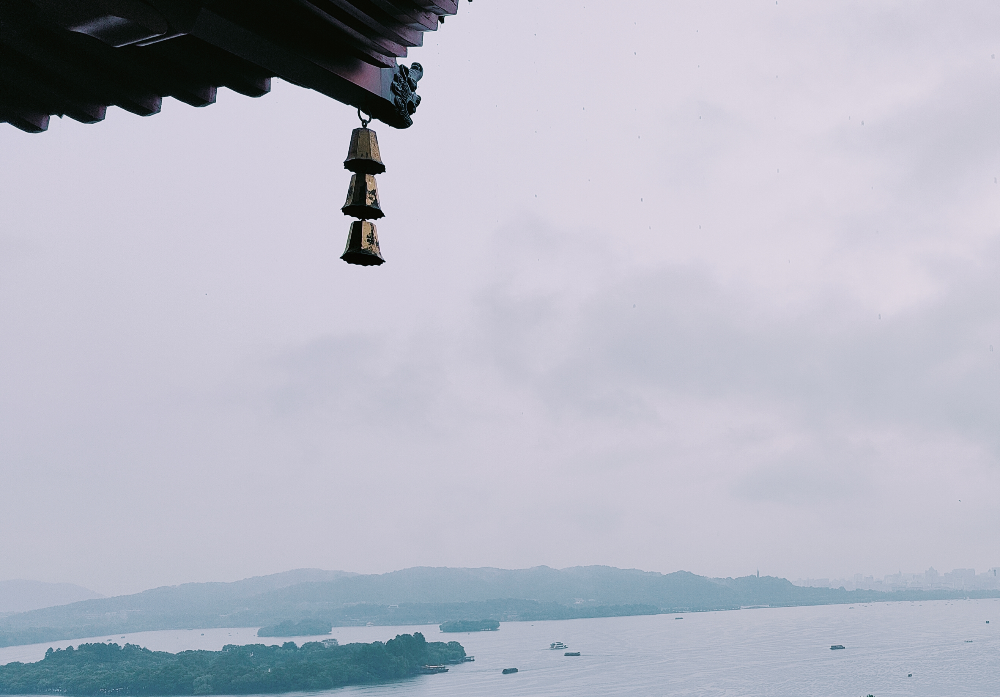

### 前言

本篇将简要记录我在 6 月的思想、经历，主题大体与「记录 · 变革中的痛苦」与「未来的记忆 · 来时的路」相符。本文应该于 7 月前结束，但一直拖延到今日（7 月 13 日）。

今年六月是非同寻常的，我在本月结束了大学生活。此前有苗头要转变的思想也在这段时间贯彻到我生活中去，我开始实在地参与生活。我此前的空想被父母的朴实与个人认知浅薄拉下马，钱成为我思考一切事情的基础（例如，女性地位的快速提升）。我将在七月初开启职场生涯，即将实在地感受钱的流通、社会分工的一个环节。

本篇将首先简要谈论「依旧运转的世界」，后讲述我个人消费理念与生活理念的变迁，再简要讲述我这段时间做了哪些事情（日志类体裁）。

### 依旧运转的世界

世界依旧在运转，依赖着约定俗成的规则和社会强加的观念（其中，大量观念将要破产）。社会发展的黄金三十年已经过去，随之而来的经济下行、社会希望缺失、政府监管失控<a href="https://t.me/wxbyg/3128">《繁华渐逝》</a>即将成为所有人公认的事实。世界运行的基本规律是：1) 少数人统治多数奴隶，同时依赖奴隶；2) 钱不会凭空产生，也不会凭空消失。

#### 游戏阐释

但是，这些规则同个人无关，**一个人可以同时是奴隶与个体的人**。不要想着改变世界，奴隶制是永恒的制度，其矛盾也是人类社会永恒的矛盾。人可以因为要赚钱而做他人的奴隶，但这之后一个人依旧是人。

《人生》游戏中，人生下来就是单人玩家，可以有队友，但是最初是没有的。任务会随时由他人发布，不一定有奖励，大概率有惩罚。这就是游戏规则——开放式世界。人可以成为奴隶，因为每个人都要扮演一个角色，但是玩家是超脱于角色的。

玩家的世界不会因为游戏而发生任何变化，即便游戏是他的所有。许多网络小说在最后都会让主角对作家比中指，因为玩家的思想是不受控的。

#### 实例阐释

近期，百度的萝卜快跑备受关注。该事件同一切其他商业热点炒作一样，永远不会有结果。

只有生产才有财富，无论是物质、还是娱乐方面。一切问题最终导向都是钱。社会经济下行是因为官员偷完了未来三十年的钱，女性地位提高是因为女性生产力不再低于工业时代与农耕时代的男性，AI 无法造就工业革命是因为无法生产财富。

萝卜快跑普及的成本极高（要求绝大多数现有车型淘汰），人们是怎么会宣称未来已来的？其技术上、安全上的缺陷无关紧要，重点是没有钱。百度在跑马圈地，和政府实行苟且操作，把钱从左口袋倒到右口袋。

世界的运转依托于钱的流通，无论这种流通是否见得了人。

### 生活经历与思想变迁

现在是8月3日，周六，本节本应于七月写完。尽管有许多时间，但我总是停不下来写这篇文章。也许出于未来不确定性的迷茫，因为我不再相信传统路径会带来同样的结果——黄金时代已经过去。而这个周六也不同于原来的任何周六，我正坐在办公室中写作这篇文章，因为需要满足某种“奋斗者”的形式主义。日后一段时间的博客也许都会在这时完成。

言归正传，本节讨论我本人生活经历与思想变迁在毕业前后发生的变化。我不太确定当时为何定这个主题，后续仅凭简单的印象来完成。

#### 生活经历

从前我十分无法理解旅游的价值，就像我最初完全无法理解阅读的价值一样。我此前认同的是“旅游是一个人从自己活腻了的地方跑到别人活腻了的地方”，事实上是没有任何价值的。

然而，当我经历过三次截然不同的旅游后，我的想法发生了巨大的改变。

第一次是同实验室的朋友一起，就在毕业典礼后出发。我们是从深圳出发，自驾游到惠州转一圈。我非常享受那两天的时间，因为毕业的重压解除与陪伴、聊天带来的轻松。惠州并不美丽，并无著名的景点或别的东西。同黄州一样，唯一出名的只有苏轼。因为种种原因，这是我第一次正经旅游。

第二次是我独自前往南昌与武汉，那几天我的微信步数在三万左右，腿都快走断了。我并不对南昌有任何其他的情感，单纯是因为买票顺便路过南昌——我第一次睡软卧，大概七个小时。将行李寄存在火车站，我背着小包就坐地铁出发去了八一广场。凌晨五点左右，刚出地铁，吸引我目光的不是八一纪念碑，而是玩风筝的老大爷。鹰型的风筝在他的手中像活生生的鹰在盘旋。因为只有一天的时间，我跟着小红书的攻略四处逛了逛，万寿宫、滕王阁等。

凌晨前往武汉，住在黄鹤楼附近。记得上一次前往武汉是小学时，当时作为穷亲戚被母亲带往舅舅家。因为诸如此类的经历，我极度厌恶非自己选择的关系——也就是一切血缘关系。根据我的记忆，那次也没去黄鹤楼。

言归正传，我前往武汉完全是因为高中同学大都在武汉读书，顺便在武汉逛逛。先是独自前往博物馆，后同两位同学会合。同样是小红书攻略，稍微逛了逛黄鹤楼、江汉路、长江边等。最令我印象深的是东湖骑行，那是非常放松的经历。

第三次是同我弟弟（高二）一起前往杭州。武汉之后，我回家躺了一两周，被父母要求带弟弟出去旅游。这是一段并不令人愉快的经历——梅雨季节的江南与性格不合的两人。仅去了下着大雨的西湖，甚至四顿饭有两顿是在酒店点的外卖。我并不喜欢他，也不喜欢这段旅途，连带着我对杭州也并无好感。（题外话：98年到07年的一代是承担前人造下恶果的一代，毫无价值的高考与极度压抑的学校氛围、经济危机与疫情带来的封闭保守使得大多数人心理不正常、无法正常地行使个人生活的能力。这代人，尤其是穷人，活着是没必要的。）

这三段经历让我认识到我作为个体能力的丧失——无法谋划自己的生活，无法通过独自行走让自己变得高兴，无法彻底放松地理解周遭的世界。这种个体能力的缺失导致我在一段时间内产生非常强烈的自杀情绪，大多数时间都带来无聊与焦虑。

克氏说“焦虑是自由带来的眩晕”——个体缺少对自己生活的谋划，过量的自由带来了对生活的无所适从。

#### 思想变迁

这段时间的思想变迁不同于此前写的东西，仅仅是生活观念变化带来的消费观念变化。

我此前认为记录是完全没必要的。因为20岁之前，人活着是不断地带来新鲜事物，拥有生命力的人会发现、创造新的事件。层出不穷的事件会让沉醉，一切都是新鲜的。当我发现世界不再新鲜时，情绪也不再能够被激发，活着显得毫无必要。如果在我20岁之前巴以冲突爆发，我会毫无保留地呼吁和平。世界又在重演，没有任何令人高兴的东西。

如同一首歌或别的什么实物，照片能够将人移置到回忆中。回忆在时间中变得越发醇厚，情绪也变得越发令人怀念。人的预设寿命只有三十岁，之后的日子要么有个新鲜事物（例如不同文化的冲击、孩子等）带来新的认知，要么靠着此前的回忆了此残生。

记录——拍照——是有其实际价值的。
